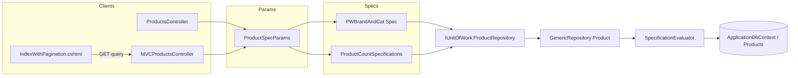

# Specification Pattern — Technical Report (10.Demo.Specifications)

# 1. Overview of the Problem

Based strictly on the code:

- **Products must be queried with filtering, sorting, eager loading (`Include`), and pagination** instead of loading every product with a single non-parameterized query.
- **Total item count** is required for pagination UI and API responses, using the **same filter rules** as the paged list but **without** applying the same pagination slice to the count.
- **Product detail** sometimes needs the same includes (brand and category) as the list, driven by a simple identity criterion.

Evidence: `ProductWithBrandAndCategorySpecifications` builds criteria from `ProductSpecParams`, applies ordering, calls `ApplyPagination`, and optionally adds `Brand` and `Category` includes. A separate `ProductCountSpecifications` repeats only the **filter** expression for counting. The API wraps results in `Pagination<ProductToReturnDto>`; the MVC layer wraps `Pagination<Product>`.

---

# 2. Why Specification Pattern Was Used

There is **no explicit design document** in the repository explaining intent. From **code structure alone**, the pattern serves to:

1. **Encapsulate query shape** — criteria, includes, sort, and skip/take — in `ISpecifications<T>` / `BaseSpecifications<T>` instead of scattering `Where` / `Include` / `OrderBy` / `Skip`/`Take` across controllers or repositories.
2. **Reuse the repository pipeline** — `GenericRepository<T>` delegates to `SpecificationEvaluator<T>.GetQuery`, so any entity using this stack can use the same mechanism (the interface is generic `T : BaseEntity`).
3. **Pair “list” and “count” specifications** — `ProductWithBrandAndCategorySpecifications` and `ProductCountSpecifications` share the same boolean filter over `Product`, while the list spec adds ordering, pagination, and optional includes.

## 2.1 Coexistence with non-specification repository methods

The same solution **still uses hand-written LINQ** on `ProductRepository` for several flows. Those methods **do not** go through `ISpecifications<Product>`:

| Repository method | What it does (from code) | Typical consumer |
|-------------------|-------------------------|------------------|
| `GetProductsWithBrandsAndCategoryAsync` | `Include` Brand + Category, `AsNoTracking`, full list | `ProductsController.GetAllAsync`, `MVCProductsController.Index` |
| `GetSingleProductWithBrandsAndCategoryAsync` | `Include` Brand + Category, filter by `Id` | `ProductsController.GetByIdAsync`, create redirect path, MVC delete/detail |
| `GetLast5ProductsAsync` | `Include`, `OrderByDescending` `Id`, `Take(5)` | `ProductsController.GetLast5Async` |

So the specification pipeline is **additive**: it complements—rather than replaces—those repository methods inside this demo.

**File:** `src/Application.Infrastructure/Persistence/ProductRepository.cs`

```csharp
    public async Task<IReadOnlyList<Product>> GetProductsWithBrandsAndCategoryAsync(CancellationToken cancellationToken = default)
    {
        return await _dbContext.Set<Product>()
            .Include(p => p.Brand)
            .Include(p => p.Category)
            .AsNoTracking()
            .ToListAsync(cancellationToken);
    }

    public async Task<Product?> GetSingleProductWithBrandsAndCategoryAsync(Guid id, CancellationToken cancellationToken = default)
    {
        return await _dbContext.Set<Product>()
            .Include(p => p.Brand)
            .Include(p => p.Category)
            .AsNoTracking()
            .FirstOrDefaultAsync(p => p.Id == id, cancellationToken);
    }
```

---

# 3. Architecture Breakdown

| Symbol | Kind | File (under `10.Demo.Specifications`) |
|--------|------|----------------------------------------|
| `ISpecifications<T>` | Interface | `src/Application.Core/Specifications/ISpecifications.cs` |
| `BaseSpecifications<T>` | Base class | `src/Application.Core/Specifications/BaseSpecifications.cs` |
| `BaseSpecificationParams` | Record (query parameters) | `src/Application.Core/Specifications/BaseSpecificationParams.cs` |
| `ProductSpecParams` | Record | `src/Application.Core/Specifications/ProductSpecifications/ProductSpecParams.cs` |
| `ProductWithBrandAndCategorySpecifications` | Concrete specification | `src/Application.Core/Specifications/ProductSpecifications/ProductWithBrandAndCategorySpecifications.cs` |
| `ProductCountSpecifications` | Concrete specification | `src/Application.Core/Specifications/ProductSpecifications/ProductCountSpecifications.cs` |
| `SpecificationEvaluator<T>` | Static evaluator | `src/Application.Infrastructure/SpecificationEvaluator.cs` |
| `IGenericRepository<T>` | Repository contract (spec methods) | `src/Application.Core/Persistence/IGenericRepository.cs` |
| `GenericRepository<T>` | Repository implementation | `src/Application.Infrastructure/Persistence/GenericRepository.cs` |
| `IProductRepository` | Extends `IGenericRepository<Product>` | `src/Application.Core/Persistence/IProductRepository.cs` |
| `ProductsController` | API consumer | `src/Application/Controllers/ProductsController.cs` |
| `MVCProductsController` | MVC consumer | `src/Application.Client/Controllers/MVCProductsController.cs` |
| `IndexWithPagination.cshtml` | Razor UI | `src/Application.Client/Views/MVCProducts/IndexWithPagination.cshtml` |
| `Pagination<T>` | Result wrapper | `src/Application.Core/Models/Pagination.cs` |
| `Product`, `BaseEntity` | Domain | `src/Application.Core/Entities/Product.cs`, `BaseEntity.cs` |
| `BaseSettingEntity` | Domain base (names for search/sort) | `src/Application.Core/Entities/BaseSettingEntity.cs` |
| `IUnitOfWork` / `UnitOfWork` | Composition root for repos | `src/Application.Core/Persistence/IUnitOfWork.cs`, `src/Application.Infrastructure/Persistence/UnitOfWork.cs` |
| `DependencyInjection.AddInfrastructure` | Registers EF + repos | `src/Application.Infrastructure/DependencyInjection.cs` |
| `ApplicationDbContext` | EF Core context (`DbSet<Product>`) | `src/Application.Infrastructure/Data/ApplicationDbContext.cs` |
| `BaseApiController` | Shared API behaviors (validators, Result helpers) | `src/Application/Controllers/BaseApiController.cs` |

**Not present in the provided codebase:** a solution file (`.sln`); UI frameworks such as React, Flutter, or Angular (the UI here is **ASP.NET Core MVC + Razor**).

## 3.1 Layering (projects)

Rough dependency direction visible from namespaces and registrations:

| Project / area | Responsibility (evidence from code) |
|----------------|---------------------------------------|
| `Application.Core` | `ISpecifications<T>`, `BaseSpecifications<T>`, product specs, `IGenericRepository<T>`, `IProductRepository`, entities, `Pagination<T>` |
| `Application.Infrastructure` | `ApplicationDbContext`, `GenericRepository<T>`, `ProductRepository`, `SpecificationEvaluator<T>`, `UnitOfWork`, `AddInfrastructure` |
| `Application` (API) | `ProductsController` — binds `ProductSpecParams`, builds specs |
| `Application.Client` (MVC) | `MVCProductsController.IndexWithPagination`, Razor views |

## 3.2 Composition root: DI registration

**File:** `src/Application.Infrastructure/DependencyInjection.cs`

**Purpose:** Wires EF Core SqlServer + open-generic repository + concrete `ProductRepository` + unit of work.

```csharp
        services.AddDbContext<ApplicationDbContext>(options =>
            options.UseSqlServer(configuration.GetConnectionString("DefaultConnection")));

        services.AddScoped(typeof(IGenericRepository<>), typeof(GenericRepository<>));
        services.AddScoped<IProductRepository, ProductRepository>();
        services.AddScoped<IUnitOfWork, UnitOfWork>();
```

`IProductRepository` extends `IGenericRepository<Product>`, so `ProductRepository` inherits **both** the manual LINQ helpers **and** `GetAllWithSpecificationAsync` / `GetCountAsync(spec)` / `GetByIdWithSpecificationAsync` from `GenericRepository<Product>`.

## 3.3 Unit of work and repository lifetime

**File:** `src/Application.Infrastructure/Persistence/UnitOfWork.cs`

Within a single scoped `UnitOfWork`, repository instances are **cached per interface type** inside a `Hashtable` keyed by type full name (`GetOrCreateRepository`). `ProductRepository` is instantiated with `(ApplicationDbContext context)` via `Activator.CreateInstance`, matching its public constructor requirement.

```csharp
    public IProductRepository ProductRepository 
        => GetOrCreateRepository<IProductRepository, ProductRepository>();

    private TRepo GetOrCreateRepository<TRepo, TConcreteRepo>()
        where TConcreteRepo : TRepo
    {
        var key = typeof(TRepo).FullName;

        if (_repositories.ContainsKey(key!))
            return (TRepo)_repositories[key!]!;

        var repository =
            (TRepo)Activator.CreateInstance(typeof(TConcreteRepo), context)!;

        _repositories.Add(key!, repository);

        return (TRepo)_repositories[key!]!;
    }
```

## 3.4 Data access entry point for `Product`

**File:** `src/Application.Infrastructure/Data/ApplicationDbContext.cs`

Specifications ultimately run against `DbSet<T>` from this context (`GenericRepository` uses `dbContext.Set<T>()`).

```csharp
    public DbSet<Product> Products { get; set; }
    public DbSet<ProductBrand> ProductBrands { get; set; }
    public DbSet<ProductCategory> ProductCategories { get; set; }
```

## 3.5 High-level flow (diagram)



---

# 4. How the Specification Pattern is Implemented

## 4.1 `ISpecifications<T>` — contract

**File:** `src/Application.Core/Specifications/ISpecifications.cs`  

**Purpose:** Defines everything the evaluator needs to turn a bare `DbSet`-backed query into a composed `IQueryable<T>`.

**Why it exists:** Central contract for specifications so repositories do not expose many ad-hoc query methods.

```csharp
namespace Application.Core;

public interface ISpecifications<T> where T : BaseEntity
{
    public Expression<Func<T, bool>>? Criteria { get; }
    public List<Expression<Func<T, object>>> Includes { get; }

    public Expression<Func<T, object>>? OrderBy { get; }
    public Expression<Func<T, object>>? OrderByDescending { get; }

    public int Skip { get; }
    public int Take { get; }
    public bool IsPaginationEnabled { get; }
}
```

### 4.1.1 What each property is for (and why it exists)

Each member is consumed by **`SpecificationEvaluator<T>.GetQuery`** (`src/Application.Infrastructure/SpecificationEvaluator.cs`). Below is **why it is needed** in this codebase, tied to actual usage.

| Property | Type | Why it’s needed |
|----------|------|----------------|
| **`Criteria`** | `Expression<Func<T, bool>>?` | **Filter** translated to SQL `WHERE`. When non-null, the evaluator applies `query.Where(specifications.Criteria)`. **Examples:** search + optional `BrandId` / `CategoryId` in `ProductWithBrandAndCategorySpecifications(ProductSpecParams)` and `ProductCountSpecifications`; `e => e.Id == id` for `ProductWithBrandAndCategorySpecifications(Guid id)`. **`null`** leaves the dataset unfiltered at the criterion step (see parameterless product spec constructor `: base()` with no assignment). Expressions (not delegates) lets **EF Core** inspect the tree and translate to SQL rather than fetching everything into memory first. |
| **`Includes`** | `List<Expression<Func<T, object>>>` | **Eager loading** of related entities. After filter/order/page, the evaluator folds each entry with `.Include(includeQuery)`. **Examples:** `ProductWithBrandAndCategorySpecifications` adds `Brand` and `Category` in `AddIncludes()`. Needed so list/detail APIs return **`Brand`** and **`Category`** without N+1 queries. `ProductCountSpecifications` leaves **`Includes`** empty—it only cares about **count**, not navigation graphs. **`WithIncludes`** on `ProductSpecParams` skips adding includes when **false**. |
| **`OrderBy`** | `Expression<Func<T, object>>?` | **Ascending sort** translated to SQL `ORDER BY`. Used when set; evaluator runs `OrderBy(OrderBy)`. **Examples:** default `AddOrderBy(p => p.Name!)` and **`priceAsc`** branch in `ProductWithBrandAndCategorySpecifications`. Only one axis is modeled: subclasses call **`AddOrderBy`** or **`AddOrderByDescending`**, not both for the same spec instance in this demo. |
| **`OrderByDescending`** | `Expression<Func<T, object>>?` | **Descending sort** — `OrderByDescending(OrderByDescending)` when `OrderBy` is not set (**else-if** branch in evaluator). **Example:** **`priceDesc`** in the product specification `switch`. **Why separate from `OrderBy`:** evaluator treats them as mutually exclusive alternate branches for a single sort direction. |
| **`Skip`** | `int` | **Offset** into the ordered/filtered sequence when pagination is enabled. Passed to **`query.Skip(specifications.Skip)`**. **Example:** `ApplyPagination(specParams.PageSize * (specParams.PageIndex - 1), specParams.PageSize)` so page index 1 ⇒ skip **0**. |
| **`Take`** | `int` | **Limit** (`page size`) applied as **`Take(specifications.Take)`** after **`Skip`**. Works with **`BaseSpecificationParams.PageSize`** (capped at max **20**) to bound result size sent to API/MVC clients. |
| **`IsPaginationEnabled`** | `bool` | **Guard** for paging: only when **`true`** does the evaluator call **`Skip`** and **`Take`**. **`BaseSpecifications.ApplyPagination`** sets **`IsPaginationEnabled = true`** and fills **`Skip`** / **`Take`**. **`ProductCountSpecifications`** does not call **`ApplyPagination`**, so paging is off and **`GetCountAsync`** counts every row matching the filter—which must match list filters for **`Pagination.Count`**. **`GetById`**-style specs similarly leave paging off. |

**Cross-reference:** the evaluator reads properties in fixed order (**Where → Order → Skip/Take → Include**); see §4.3.1.

## 4.2 `BaseSpecifications<T>` — shared behavior

**File:** `src/Application.Core/Specifications/BaseSpecifications.cs`  

**Purpose:** Default implementation storing criteria, includes, order, and pagination flags; provides protected helpers for subclasses.

**Why it exists:** Concrete specs (e.g. product) inherit and set state in constructors without reimplementing the interface.

```csharp
namespace Application.Core;

public class BaseSpecifications<T> : ISpecifications<T> where T : BaseEntity
{
    public Expression<Func<T, bool>>? Criteria { get; protected set; }
    public List<Expression<Func<T, object>>> Includes { get; protected set; } = [];
    public Expression<Func<T, object>>? OrderBy { get; protected set; }
    public Expression<Func<T, object>>? OrderByDescending { get; protected set; }
    public int Skip { get; protected set; }
    public int Take { get; protected set; }
    public bool IsPaginationEnabled { get; protected set; }

    public BaseSpecifications()
    {
    }

    public BaseSpecifications(Expression<Func<T, bool>> criteria)
        => Criteria = criteria;

    protected void AddOrderBy(Expression<Func<T, object>> orderByExpression)
        => OrderBy = orderByExpression;

    protected void AddOrderByDescending(Expression<Func<T, object>> orderByDescExpression)
        => OrderByDescending = orderByDescExpression;

    protected void ApplyPagination(int skip, int take)
    {
        IsPaginationEnabled = true;
        Skip = skip;
        Take = take;
    }
}
```

## 4.3 `SpecificationEvaluator<T>` — apply spec to `IQueryable`

**File:** `src/Application.Infrastructure/SpecificationEvaluator.cs`  

**Purpose:** Apply `Where`, `OrderBy` / `OrderByDescending`, `Skip`/`Take`, then aggregate `Include` over the specification’s `Includes` list.

**Why it exists:** Single place that interprets `ISpecifications<T>` for EF Core queries.

```csharp
namespace Application.Infrastructure;

public static class SpecificationEvaluator<T> where T : BaseEntity
{
    public static IQueryable<T> GetQuery(IQueryable<T> inputQuery, ISpecifications<T> specifications)
    {
        IQueryable<T> query = inputQuery;
        if (specifications.Criteria is not null)
            query = query.Where(specifications.Criteria);

        if (specifications.OrderBy is not null)
            query = query.OrderBy(specifications.OrderBy);
        else if (specifications.OrderByDescending is not null)
            query = query.OrderByDescending(specifications.OrderByDescending);

        if (specifications.IsPaginationEnabled)
            query = query
                .Skip(specifications.Skip)
                .Take(specifications.Take);

        query = specifications.Includes.Aggregate(query, (currentQuery, includeQuery)
            => currentQuery.Include(includeQuery));

        return query;
    }
}
```

### 4.3.1 Order of composition (exactly as coded)

Steps in `SpecificationEvaluator<T>.GetQuery` **always** occur in this sequence:

1. Start from `DbSet<T>` as `inputQuery`.
2. If `Criteria` is non-null → `Where(Criteria)`.
3. Else branch: if `OrderBy` set → `OrderBy`; else if `OrderByDescending` set → `OrderByDescending`.
4. If `IsPaginationEnabled` → `Skip(Skip)`, then `Take(Take)`.
5. Fold `Includes` onto the query with `.Include(...)`.

Comment in `ISpecifications<T>` acknowledges a possible future richer include model:

```csharp
    //List<Func<IQueryable<T>, IQueryable<T>>> Includes { get; } // for adding support for ThenInclude (query chaining)
```

The **count** specification path uses `GetCountAsync(ISpecifications<T>)` which still runs through the same evaluator: for `ProductCountSpecifications`, pagination is never enabled (`ApplyPagination` is not called), and `Includes` stays empty unless a future change adds them—which keeps the counted set aligned with the filter-only portion of the list query.

## 4.4 `GenericRepository<T>` — persistence entry points

**File:** `src/Application.Infrastructure/Persistence/GenericRepository.cs`  

**Purpose:** Expose `GetAllWithSpecificationAsync`, `GetByIdWithSpecificationAsync`, and `GetCountAsync` that all route through `ApplySpecification` → `SpecificationEvaluator<T>.GetQuery`.

**Why it exists:** Controllers and services depend on `IGenericRepository<T>` without knowing EF composition details.

```csharp
    // Specification pattern methods
    public async Task<IReadOnlyList<T>> GetAllWithSpecificationAsync(ISpecifications<T> specifications, CancellationToken cancellationToken = default)
    {
        return await ApplySpecification(specifications)
                    .AsNoTracking()
                    .ToListAsync(cancellationToken: cancellationToken);
    }

    public async Task<T?> GetByIdWithSpecificationAsync(ISpecifications<T> specifications, CancellationToken cancellationToken = default)
    {
        return await ApplySpecification(specifications)
                    .AsNoTracking()
                    .FirstOrDefaultAsync(cancellationToken: cancellationToken);
    }

    public async Task<int> GetCountAsync(ISpecifications<T> specification, CancellationToken cancellationToken = default)
    {
        return await ApplySpecification(specification)
                    .AsNoTracking()
                    .CountAsync(cancellationToken: cancellationToken);
    }

    private IQueryable<T> ApplySpecification(ISpecifications<T> specifications)
        => SpecificationEvaluator<T>.GetQuery(dbContext.Set<T>(), specifications);
```

**Repository interface surface (spec-related):** `src/Application.Core/Persistence/IGenericRepository.cs`

```csharp
    Task<IReadOnlyList<T>> GetAllWithSpecificationAsync(ISpecifications<T> specifications, CancellationToken cancellationToken = default);
    Task<T?> GetByIdWithSpecificationAsync(ISpecifications<T> specifications, CancellationToken cancellationToken = default);
    Task<int> GetCountAsync(ISpecifications<T> specification, CancellationToken cancellationToken = default);
```

### 4.4.1 Two different `GetCountAsync` overloads

**File:** `src/Application.Core/Persistence/IGenericRepository.cs`  

The same interface exposes **predicate-based** counting and **specification-based** counting:

```csharp
    Task<int> GetCountAsync(Expression<Func<T, bool>> predicate, CancellationToken cancellationToken = default);
    // ...
    Task<int> GetCountAsync(ISpecifications<T> specification, CancellationToken cancellationToken = default);
```

**File:** `src/Application.Infrastructure/Persistence/GenericRepository.cs`

- Predicate overload: `CountAsync(predicate)` directly on `dbContext.Set<T>()`.
- Specification overload: `ApplySpecification` → full evaluator pipeline, then `CountAsync()`.

Pagination scenarios in this demo use the **specification** overload so the count uses the same criteria object family as the list query.

## 4.5 Parameter records — caps and normalization

**File:** `src/Application.Core/Specifications/BaseSpecificationParams.cs`  

**Purpose:** Hold pagination, sort, search, and `WithIncludes`; enforce max page size and uppercase search for consistent matching with product criteria.

**Why it exists:** Binds HTTP/query string parameters to a single object passed into product specifications.

```csharp
namespace Application.Core;

public record BaseSpecificationParams
{
    public bool WithIncludes { get; set; } = true;

    private const int MaxPageSize = 20;
    private int _pageSize = 10;

    public int PageSize
    {
        get => _pageSize;
        set => _pageSize = value > MaxPageSize ? MaxPageSize : value;
    }

    public int PageIndex { get; set; } = 1;
    public string? Sort { get; set; }

    private string? _search;

    public string? Search
    {
        get => _search;
        set => _search = value?.ToUpperInvariant();
    }
}
```

**File:** `src/Application.Core/Specifications/ProductSpecifications/ProductSpecParams.cs`

```csharp
namespace Application.Core;

public record ProductSpecParams : BaseSpecificationParams
{
    public Guid? BrandId { get; set; }
    public Guid? CategoryId { get; set; }
}
```

## 4.6 `ProductWithBrandAndCategorySpecifications` — business rules for listing/detail

**File:** `src/Application.Core/Specifications/ProductSpecifications/ProductWithBrandAndCategorySpecifications.cs`  

**Purpose:** Encode **filtering** (search on name fields, optional brand and category), **sorting** (`priceAsc`, `priceDesc`, default name), **pagination**, and **includes** for `Brand` and `Category`.

**Why it exists:** This is the primary domain-specific specification for product queries used by API and MVC.

```csharp
namespace Application.Core;

public class ProductWithBrandAndCategorySpecifications : BaseSpecifications<Product>
{
    public ProductWithBrandAndCategorySpecifications() : base()
    {
        AddIncludes();
    }

    public ProductWithBrandAndCategorySpecifications(ProductSpecParams specParams) 
        : base(p =>
            (
                string.IsNullOrWhiteSpace(specParams.Search) ||
                (p.Name != null && p.Name.ToUpper().Contains(specParams.Search)) ||
                (p.NameSecondLanguage != null && p.NameSecondLanguage.ToUpper().Contains(specParams.Search))
            ) &&
            (!specParams.BrandId.HasValue || p.BrandId == specParams.BrandId) &&
            (!specParams.CategoryId.HasValue || p.CategoryId == specParams.CategoryId)
        )
    {
        if (specParams.WithIncludes)
        {
            AddIncludes();
        }

        if (!string.IsNullOrWhiteSpace(specParams.Sort))
        {
            switch (specParams.Sort)
            {
                case "priceAsc":
                    AddOrderBy(p => p.Price);
                    break;
                case "priceDesc":
                    AddOrderByDescending(p => p.Price);
                    break;
                default:
                    AddOrderBy(p => p.Name!);
                    break;
            }
        }
        else
        {
            AddOrderBy(p => p.Name!);
        }

        ApplyPagination(specParams.PageSize * (specParams.PageIndex - 1), specParams.PageSize);
    }

    public ProductWithBrandAndCategorySpecifications(Guid id) : base(e => e.Id == id)
    {
        AddIncludes();
    }

    private void AddIncludes()
    {
        Includes.Add(P => P.Brand!);
        Includes.Add(P => P.Category!);
    }
}
```

### 4.6.1 Three constructors — different scenarios

| Constructor | `Criteria` | Includes | Order | Pagination |
|-------------|------------|----------|-------|------------|
| `ProductWithBrandAndCategorySpecifications()` | null (unset) | `Brand`, `Category` via `AddIncludes()` | none | disabled |
| `ProductWithBrandAndCategorySpecifications(ProductSpecParams specParams)` | search + optional brand/category | only if `specParams.WithIncludes` | sort switch or default `Name` | `PageSize * (PageIndex - 1)`, `PageSize` |
| `ProductWithBrandAndCategorySpecifications(Guid id)` | `e.Id == id` | both navigations | none | disabled |

Controllers use **`ProductSpecParams`** for pagination/listing and **`Guid id`** for `GetByIdSpecifications` endpoints. The **parameterless** constructor is defined in code but **not referenced** in `ProductsController` or `MVCProductsController` within the snippets included in this report (other call sites may exist).

Search matching: `BaseSpecificationParams.Search` uppercases inbound values (`value?.ToUpperInvariant()`); the product filter uses `ToUpper()` on `Name` and `NameSecondLanguage` when evaluating `Contains`.

Pagination skip formula: **`ApplyPagination(specParams.PageSize * (specParams.PageIndex - 1), specParams.PageSize)`** — **`PageIndex` is 1-based**.

### 4.6.2 Duplicated predicate between list and count specifications

The boolean expression passed to `: base(...)` is **duplicated** in `ProductWithBrandAndCategorySpecifications(ProductSpecParams)` and `ProductCountSpecifications(ProductSpecParams)`. The repo does **not** centralize that predicate in one shared method—visible by comparing both constructor bodies.

## 4.7 `ProductCountSpecifications` — same filter, no page slice

**File:** `src/Application.Core/Specifications/ProductSpecifications/ProductCountSpecifications.cs`  

**Purpose:** Apply **identical filter logic** as the list spec for `GetCountAsync` without ordering/pagination/includes defined here.

**Why it exists:** Total pages for UI/API need `Count` under the same filters as the current page.

```csharp
namespace Application.Core;

public class ProductCountSpecifications : BaseSpecifications<Product>
{
    public ProductCountSpecifications(ProductSpecParams specParams) 
        : base(p =>
            (
                string.IsNullOrWhiteSpace(specParams.Search) ||
                (p.Name != null && p.Name.ToUpper().Contains(specParams.Search)) ||
                (p.NameSecondLanguage != null && p.NameSecondLanguage.ToUpper().Contains(specParams.Search))
            ) &&
            (!specParams.BrandId.HasValue || p.BrandId == specParams.BrandId) &&
            (!specParams.CategoryId.HasValue || p.CategoryId == specParams.CategoryId)
        )
    {
    }
}
```

## 4.8 Domain types used by criteria

**File:** `src/Application.Core/Entities/BaseEntity.cs`

```csharp
namespace Application.Core;

public abstract class BaseEntity
{
    public Guid Id { get; set; } = Guid.CreateVersion7();
}
```

**File:** `src/Application.Core/Entities/Product.cs`

```csharp
namespace Application.Core;

public class Product : BaseSettingEntity
{
    public string? Description { get; set; }
    public string? PictureUrl { get; set; }
    public decimal Price { get; set; }

    public Guid BrandId { get; set; }
    public ProductBrand? Brand { get; set; }

    public Guid CategoryId { get; set; }
    public ProductCategory? Category { get; set; }
}
```

(`BaseSettingEntity` adds `Name` / `NameSecondLanguage`, used in search and default sort.)

## 4.9 Query parameters mapped to specifications

ASP.NET Core model binding fills `ProductSpecParams` from the query string using **property names** on `BaseSpecificationParams` and `ProductSpecParams`:

| Parameter property | Role |
|--------------------|------|
| `Search` | Optional text filter (stored uppercase via setter) |
| `Sort` | `priceAsc`, `priceDesc`, or other → default ordering branch uses `Name` |
| `PageIndex`, `PageSize` | Pagination; `PageSize` clamped to max 20 |
| `WithIncludes` | When true (default), list spec registers `Brand` and `Category` includes |
| `BrandId`, `CategoryId` | Optional GUID filters |

**API binding** — explicit `[FromQuery]`:

```csharp
public async Task<IActionResult> GetAllWithSpecificationsAndPaginationAsync([FromQuery] ProductSpecParams specParams, CancellationToken cancellationToken)
```

**MVC binding** — `ProductSpecParams` as a GET action parameter (complex type from query string by convention in minimal hosting scenarios; same property names as the Razor `name` attributes).

The Razor view uses `nameof(BaseSpecificationParams.Search)`, `nameof(ProductSpecParams.BrandId)`, etc., so HTML field names stay aligned with these properties.

---

# 5. Execution Flow Example

## 5.0 Specification-related HTTP endpoints (REST API)

**File:** `src/Application/Controllers/BaseApiController.cs` is not route-defining itself; **`ProductsController`** inherits it and implicitly uses **`[Route("api/[controller]")]`** on the base (`BaseApiController` excerpt shows `[Route("api/[controller]")] public class BaseApiController`).

**Endpoints that build specifications:**

| Verb / template (relative to `/api/products`) | Action | Specifications constructed |
|-----------------------------------------------|--------|----------------------------|
| `GET GetAllWithSpecificationsAndPagination` | `GetAllWithSpecificationsAndPaginationAsync` | `new ProductWithBrandAndCategorySpecifications(specParams)`, `new ProductCountSpecifications(specParams)` |
| `GET GetByIdSpecifications/{id:guid}` | `GetByIdSpecificationsAsync` | `new ProductWithBrandAndCategorySpecifications(id)` |

Other actions on the same controller (`GetAllAsync`, `GetByIdAsync`, projection endpoints, CRUD) use **repository methods or `Repository<Product>()`** without `ISpecifications<Product>`—see section 2.1.

## 5.1 HTTP API: paged list with specifications

**File:** `src/Application/Controllers/ProductsController.cs`

1. Client calls `GET .../GetAllWithSpecificationsAndPagination` with query parameters bound to `ProductSpecParams`.
2. Controller constructs `ProductWithBrandAndCategorySpecifications(specParams)` and calls `GetAllWithSpecificationAsync`.
3. Controller constructs `ProductCountSpecifications(specParams)` and calls `GetCountAsync`.
4. Results are mapped to DTOs and wrapped in `Pagination<ProductToReturnDto>`.

```csharp
    [HttpGet("GetAllWithSpecificationsAndPagination")]
    public async Task<IActionResult> GetAllWithSpecificationsAndPaginationAsync([FromQuery] ProductSpecParams specParams, CancellationToken cancellationToken)
    {
        ProductWithBrandAndCategorySpecifications spec = new(specParams);
        IReadOnlyList<Product> products = await _unitOfWork.ProductRepository
            .GetAllWithSpecificationAsync(spec, cancellationToken);

        var countSpec = new ProductCountSpecifications(specParams);
        int totalItems = await _unitOfWork.ProductRepository.GetCountAsync(countSpec, cancellationToken);

        List<ProductToReturnDto> dto = products
            .Adapt<List<ProductToReturnDto>>();

        var pageResult = new Pagination<ProductToReturnDto>(specParams.PageIndex, specParams.PageSize, totalItems, dto);

        return Ok(pageResult);
    }
```

```csharp
    [HttpGet("GetByIdSpecifications/{id:guid}")]
    public async Task<IActionResult> GetByIdSpecificationsAsync([FromRoute] Guid id, CancellationToken cancellationToken)
    {
        ProductWithBrandAndCategorySpecifications spec = new(id);
        Product? product = await _unitOfWork.ProductRepository
            .GetByIdWithSpecificationAsync(spec, cancellationToken);
        // ... NotFound / Ok with DTO ...
    }
```

**Internal chain:** `ProductRepository` → `GenericRepository<Product>.GetAllWithSpecificationAsync` → `ApplySpecification` → `SpecificationEvaluator<Product>.GetQuery` → EF executes composed query.

## 5.2 MVC: same specifications, `Pagination<Product>`

**File:** `src/Application.Client/Controllers/MVCProductsController.cs`

```csharp
    public async Task<IActionResult> IndexWithPagination(ProductSpecParams specParams, CancellationToken cancellationToken)
    {
        ProductWithBrandAndCategorySpecifications spec = new(specParams);
        IReadOnlyList<Product> products = await _unitOfWork.ProductRepository
            .GetAllWithSpecificationAsync(spec, cancellationToken);

        var countSpec = new ProductCountSpecifications(specParams);
        int totalItems = await _unitOfWork.ProductRepository.GetCountAsync(countSpec, cancellationToken);

        var pageResult = new Pagination<Product>(specParams.PageIndex, specParams.PageSize, totalItems, products);

        return View(pageResult);
    }
```

**File:** `src/Application.Core/Models/Pagination.cs`

```csharp
public class Pagination<T>
{
    public int PageIndex { get; set; }
    public int PageSize { get; set; }
    public int Count { get; set; }
    public IReadOnlyList<T>? Data { get; set; }

    public Pagination(int pageIndex, int pageSize, int count, IReadOnlyList<T> data)
    {
        PageIndex = pageIndex;
        PageSize = pageSize;
        Count = count;
        Data = data;
    }
}
```

## 5.3 Get-by-id flow using the same specification class

For `GET .../GetByIdSpecifications/{id:guid}`, the controller uses the **`Guid`** constructor overload. That sets **`Criteria`** to identity match and **`AddIncludes()`** for navigations—the query is still executed through **`GetByIdWithSpecificationAsync`**, which ends in **`FirstOrDefaultAsync`** (see `GenericRepository<T>`).

## 5.4 MVC: `Index` vs `IndexWithPagination`

| MVC action | Data access | Specifications |
|------------|-------------|----------------|
| `Index` | `_productRepository.GetProductsWithBrandsAndCategoryAsync` | **No** — inline-style repository method (see §2.1) |
| `IndexWithPagination` | `ProductRepository` via `GetAllWithSpecificationAsync` + `GetCountAsync(countSpec)` | **Yes** |

This shows the same host app offering both **legacy “load all with includes”** and **spec-driven filtered pages**.

---

# 6. UI Integration

The UI layer is **Razor (`.cshtml`)**, not React/Angular/Flutter.

## 6.1 How the UI connects to specification logic

- The view `IndexWithPagination.cshtml` is strongly typed to `Pagination<Product>`.
- User actions issue **GET** requests to `IndexWithPagination` with query parameters whose names align with `BaseSpecificationParams` and `ProductSpecParams` (`Search`, `BrandId`, `CategoryId`, `Sort`, `PageIndex`, `PageSize`).
- ASP.NET Core **model binding** maps those query values to `ProductSpecParams` on the action `IndexWithPagination`.
- The controller builds the same `ProductWithBrandAndCategorySpecifications` and `ProductCountSpecifications` as the API.

## 6.2 UI snippets — form and routes

**File:** `src/Application.Client/Views/MVCProducts/IndexWithPagination.cshtml`

**Purpose:** Submit filters and hidden pagination/sort fields; read current query for display state.

**Why it exists:** End users drive the same parameters consumed by `ProductSpecParams` and thus by the specifications.

```cshtml
@model Pagination<Product>
@inject IUnitOfWork _unitOfWork

@{
    // ...
    string? searchQuery = Context.Request.Query[nameof(BaseSpecificationParams.Search)];
    Guid? brandFilter = Guid.TryParse(Context.Request.Query[nameof(ProductSpecParams.BrandId)], out Guid parseBrandId) ? parseBrandId : null;
    Guid? categoryFilter = Guid.TryParse(Context.Request.Query[nameof(ProductSpecParams.CategoryId)], out Guid parseCategoryId) ? parseCategoryId : null;
    // ...
}
```

```cshtml
                    <form asp-action="IndexWithPagination" method="get" class="flex-grow-1">
                        <input type="hidden" name="@nameof(BaseSpecificationParams.PageIndex)" value="1" />
                        <input type="hidden" name="@nameof(BaseSpecificationParams.PageSize)" value="@Model.PageSize" />
                        <input type="hidden" name="@nameof(BaseSpecificationParams.Sort)" value="@sortedBy" />

                        <input class="form-control flex-grow-1"
                               name="@nameof(BaseSpecificationParams.Search)"
                               value="@searchQuery"
                               placeholder="@Resource.Search..." />

                        <select id="filterBrandId" name="@nameof(ProductSpecParams.BrandId)" class="form-select">
                            <!-- options -->
                        </select>
                        <select id="filterCategoryId" name="@nameof(ProductSpecParams.CategoryId)" class="form-select">
                            <!-- options -->
                        </select>

                        <button type="submit" class="btn btn-primary">@Resource.Search</button>
                    </form>
```

Sort and pagination links preserve `Search`, `BrandId`, `CategoryId`, `Sort`, `PageIndex`, and `PageSize` via `asp-route-*` helpers, which keeps the MVC request aligned with `ProductSpecParams` for the next specification build.

## 6.3 Auxiliary data for filters (not specification-driven)

The view loads **all** brands and categories for `<select>` options using the generic repository—**not** through `ISpecifications<T>`:

**File:** `src/Application.Client/Views/MVCProducts/IndexWithPagination.cshtml`

```cshtml
@{
    // ...
    var brandsList = await _unitOfWork.Repository<ProductBrand>().GetAllAsync();
    var categoriesList = await _unitOfWork.Repository<ProductCategory>().GetAllAsync();
    // ...
}
```

**Purpose:** Populate filter dropdowns. **Why separate from specs:** only the **product** list/count use `ProductWithBrandAndCategorySpecifications`; reference lists are unconstrained `GetAllAsync()` calls.

`totalPages` is derived in the view as `Ceiling((double)Model.Count / Model.PageSize)` where `Model.Count` is the **filtered total** from `GetCountAsync(ProductCountSpecifications)` passed into `Pagination<Product>`.

## 6.4 Pagination links — carrying spec parameters across pages

**File:** `src/Application.Client/Views/MVCProducts/IndexWithPagination.cshtml`

**Purpose:** Each page link re-submits the same filter/sort context with a new `PageIndex`.

```cshtml
        <nav aria-label="Products pagination">
            <ul class="pagination justify-content-center">
                @if (Model.PageIndex <= 1)
                {
                    <li class="page-item disabled">
                        <a class="page-link">@Resource.Previous</a>
                    </li>
                }
                else
                {
                    <li class="page-item">
                        <a asp-action="IndexWithPagination"
                           asp-route-PageIndex="@(Model.PageIndex - 1)"
                           asp-route-PageSize="@Model.PageSize"
                           asp-route-Search="@searchQuery"
                           asp-route-BrandId="@brandFilter"
                           asp-route-CategoryId="@categoryFilter"
                           asp-route-Sort="@(sortedBy == "Name" ? null : sortedBy)"
                           asp-route-BrandId="@(brandFilter?.ToString())"
                           asp-route-CategoryId="@(categoryFilter?.ToString())"
                           class="page-link">
                            @Resource.Previous
                        </a>
                    </li>
                }

                @for (int i = 1; i <= totalPages; i++)
                {
                    <li class="page-item @(i == Model.PageIndex ? "active" : "")">
                        <a asp-action="IndexWithPagination"
                           asp-route-PageIndex="@i"
                           asp-route-PageSize="@Model.PageSize"
                           asp-route-Search="@searchQuery"
                           asp-route-BrandId="@(brandFilter?.ToString())"
                           asp-route-CategoryId="@(categoryFilter?.ToString())"
                           asp-route-Sort="@(sortedBy == "Name" ? null : sortedBy)"
                           class="page-link">@i</a>
                    </li>
                }
                <!-- Next link block follows the same pattern in file -->
            </ul>
        </nav>
```

The file contains **repeated** `asp-route-BrandId` / `asp-route-CategoryId` attributes on the same `<a>` tag for Previous/Next (e.g. lines 224–228 as shown above). That is **exactly as in source**; tag helpers typically use the last value supplied for duplicate keys.

---

# 7. Summary

| Question | Answer (from code only) |
|----------|-------------------------|
| **What problem was solved?** | Server-side **filtered, sorted, included, and paginated** product queries plus a matching **filtered count**, exposed through both **Web API** and **MVC**. |
| **What did the Specification pattern achieve here?** | A reusable **query description** (`ISpecifications<T>`), **composition** (`SpecificationEvaluator`), and **repository methods** that execute any specification consistently; **product-specific rules** live in `ProductWithBrandAndCategorySpecifications` and `ProductCountSpecifications`. |
